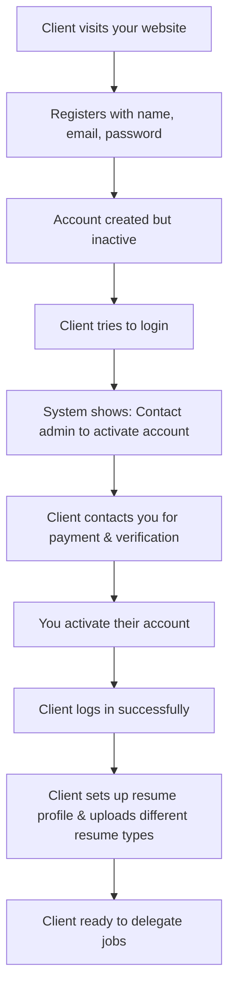
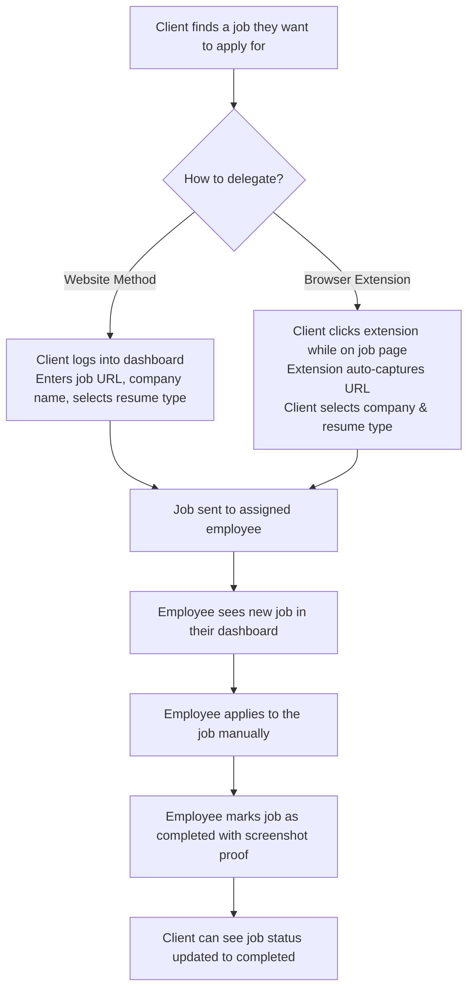
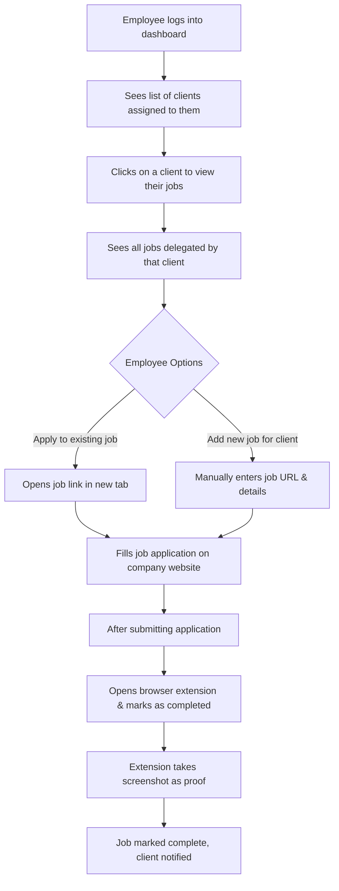
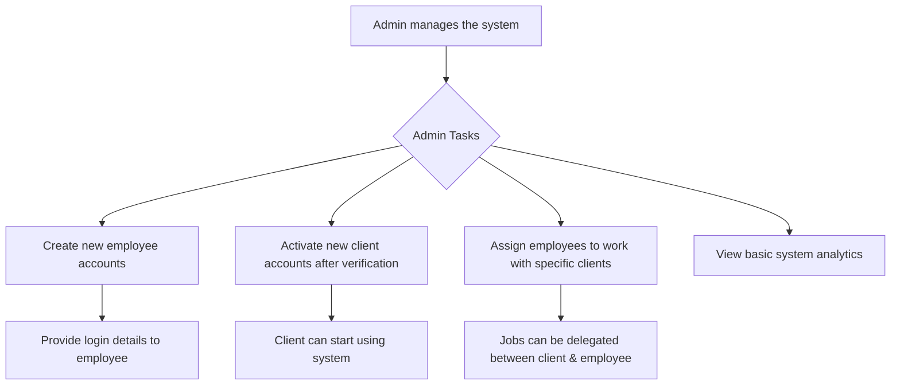

# Job Application Delegation System

## System Flow & Feature Overview

---

## 🎯 **What This System Does**

This platform allows your clients to delegate their job applications to your team of employees. Clients can easily send job opportunities to your employees, who will then apply on their behalf. The system provides complete transparency so clients can track their applications while you maintain full control over the process.

**Key Benefits:**

- **Clients save time** by delegating applications to professionals
- **Employees earn money** by handling applications efficiently
- **You maintain control** with full oversight and management capabilities

---

## 👥 **User Types & What They Can Do**

### **🔹 Super Admin (You)**

- Complete access to manage the entire system
- Can create Admin accounts to help you manage operations

### **🔹 Admin (Your Team Managers)**

- Create employee accounts and provide login credentials
- Approve new client registrations after payment verification
- Assign employees to work with specific clients
- View basic analytics about system usage

### **🔹 Client (Pays for Service)**

- Register on your website and get account activated by admin
- Create their professional resume profiles with different versions
- Send job opportunities to assigned employees via website or browser extension
- Track the status of all their job applications

### **🔹 Employee (Applies to Jobs)**

- Login with credentials provided by admin
- View jobs assigned by their clients
- Apply to jobs manually on job websites
- Mark applications as complete with proof
- Can also find additional job opportunities for clients

---

## 🔄 **How The System Works**

### **Step 1: Client Gets Started**

### **Step 2: How Job Delegation Works**

### **Step 3: Employee Workflow**

### **Step 4: Admin Management**

---

## 💼 **What Each User Sees in Their Dashboard**

### **Client Dashboard**

**Main Features:**

- **My Employees**: See which employees are assigned to handle their applications
- **Job Applications**: Complete list of all delegated jobs with current status
- **Quick Job Submission**: Fast way to delegate new jobs with URL and resume type
- **Resume Management**: Update their professional information and manage different resume versions
- **Application Tracking**: See which jobs are pending, in progress, or completed

### **Employee Dashboard**

**Main Features:**

- **My Clients**: Cards showing all clients they work with
- **Client Jobs**: When they click on a client, see all jobs for that specific client
- **Resume Access**: View client's professional information and download selected resume type
- **Job Processing**: Open job links and apply on behalf of clients
- **Add Opportunities**: Can manually add new job opportunities they find for clients
- **Completion Tracking**: Mark jobs as done with screenshot proof

### **Admin Control Panel**

**Main Features:**

- **Employee Management**: Create new employee accounts and assign them to clients
- **Client Approval**: Activate new client registrations after payment verification
- **Assignment Control**: Decide which employees work with which clients
- **Basic Analytics**: See how many jobs are being processed and completed
- **System Overview**: General view of all activity in the system

---

## ⚙️ **Key System Features**

### **Resume Profile System**

- Clients create one complete professional profile
- They can upload multiple resume versions (e.g., "Data Analyst Resume", "Marketing Resume")
- Each version has a name and PDF file
- Employees can see which resume type to use for each job

### **Automatic Job Assignment**

- When client delegates a job, system automatically assigns it to one of their employees
- Jobs are distributed evenly among all employees assigned to that client
- No manual assignment needed from admin side

### **Browser Extension**

- Works on any job website (LinkedIn, Indeed, company career pages, etc.)
- Automatically detects the job URL when client is on a job page
- Simple interface to select resume type and delegate job
- For employees: easy way to mark jobs as completed with screenshot

### **Job Status Tracking**

- **Pending**: Job just delegated, waiting for employee to start
- **Completed**: Employee finished application and provided proof
- **Delayed**: Job not completed within 24 hours (simple automatic flag)

### **Proof System**

- When employee completes a job, browser extension automatically takes screenshot
- Screenshot serves as proof that application was submitted
- Client can see this proof in their dashboard

### **Simple Analytics**

- Basic numbers like total jobs delegated, completed, pending
- Employee performance overview (how many jobs each employee completed)
- Client activity summary
- No complex reports - just essential numbers for business overview

---

## 🔄 **Complete User Journey Example**

**Scenario**: Client "John" wants to apply for a Data Analyst position

1. **John registers** on your website → **Admin activates** his account after payment
2. **Admin assigns** 2 employees (Sarah & Mike) to work with John
3. **John sets up** his resume profile and uploads "Data Analyst Resume" PDF
4. **John finds job** on LinkedIn → **Uses browser extension** → Selects "Data Analyst" resume type → **Delegates job**
5. **System assigns** job to Sarah (automatic distribution)
6. **Sarah sees** new job in her dashboard → **Opens job link** → **Applies manually** using John's resume
7. **Sarah completes** application → **Uses extension** to mark as done → **Screenshot captured** as proof
8. **John sees** in his dashboard that job status changed to "Completed" with screenshot proof

---

## 🏗️ **System Components**

### **Web Platform**

- Secure login system for different user types
- Responsive dashboard that works on desktop and mobile
- File upload system for resume PDFs
- Job tracking and status management

### **Browser Extension**

- Works on Chrome browser
- Integrates seamlessly with web platform
- Auto-detects job URLs on career websites
- Screenshot capture functionality

### **Backend System**

- Secure user authentication and data storage
- Automatic job distribution among employees
- File storage for resumes and screenshots
- Basic analytics calculation

---

**This system streamlines your job application service business by providing clear workflows, complete transparency, and easy management for all parties involved.**
